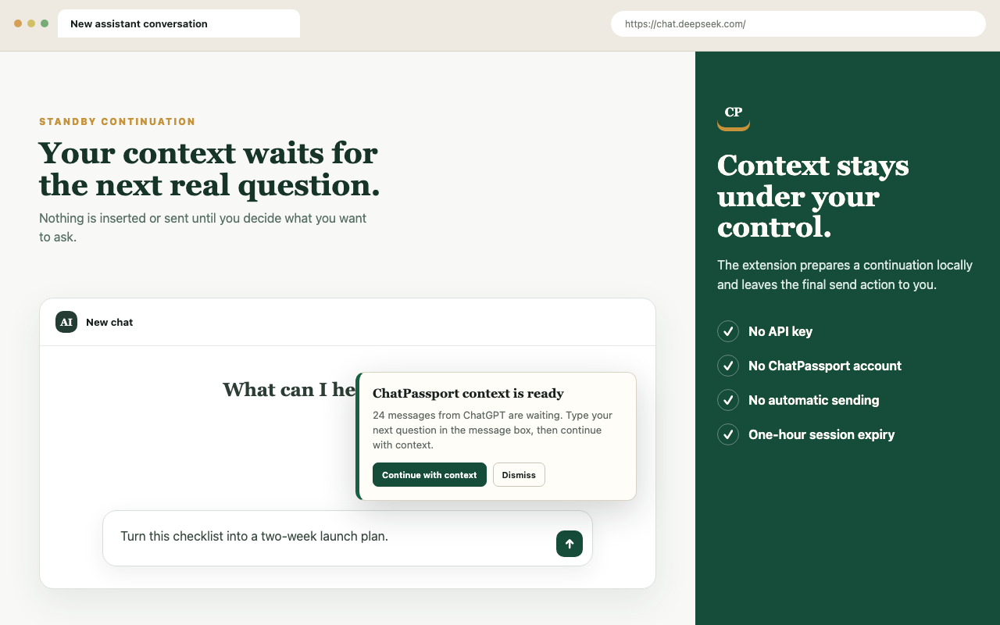
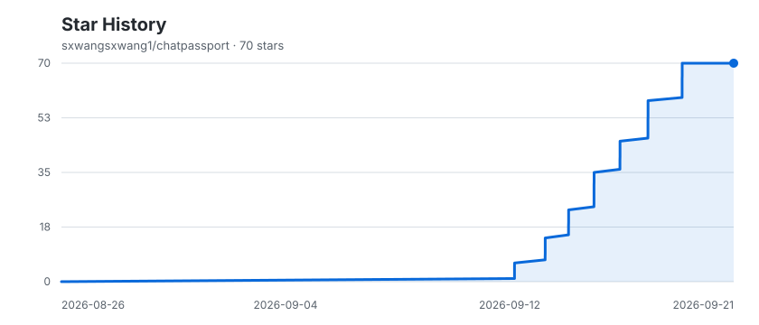

<div align="center">

# ChatPassport

### Carry the context. Keep control.

Continue AI conversations across ChatGPT, Claude, Gemini, and DeepSeek — locally, without API keys or a ChatPassport account.

[](https://chromewebstore.google.com/detail/chatpassport/anmmhpfpbaafkgdhalbllhmaejeappmb)

[](https://github.com/sxwangsxwang1/chatpassport/stargazers)

[](https://chromewebstore.google.com/detail/chatpassport/anmmhpfpbaafkgdhalbllhmaejeappmb)


[Chrome Web Store](https://chromewebstore.google.com/detail/chatpassport/anmmhpfpbaafkgdhalbllhmaejeappmb) · [How to use](#how-to-use) · [Supported platforms](#supported-platforms) · [Privacy](PRIVACY.md) · [Development](#development)

</div>



## What is ChatPassport?

ChatPassport moves the useful context of an AI conversation to another supported assistant while keeping the user in control of the final message.

Instead of pasting a transcript by hand or sending a context-only message, ChatPassport uses a continuation flow:

1. Read the conversation you choose.
2. Open the destination assistant with the context stored locally.
3. Let you type the next question first.
4. Combine that question with the selected conversation context.
5. Let you review the complete draft and send it yourself.

The destination receives one useful continuation request. ChatPassport never clicks Send automatically.

## Features

- Continue conversations across ChatGPT, Claude, Gemini, and DeepSeek.
- Choose the latest 20, 50, 100, or all captured messages.
- Keep transfer data in the current browser session.
- Wait for a new question before inserting migrated context.
- Verify that the destination editor accepted the complete draft.
- Preserve the user's original question if insertion fails.
- Keep the newest complete messages when a draft exceeds the safe size.
- Export conversations as structured ChatPassport JSON or readable Markdown.
- Import previously exported `.chatpassport.json` files.
- Copy formatted context manually when needed.
- Use the extension without an API key, ChatPassport account, analytics, or tracking.

## Supported platforms

| Platform | Read conversations | Continue with context | Import and export | Status |
| --- | :---: | :---: | :---: | --- |
| ChatGPT | ✓ | ✓ | ✓ | Supported |
| Claude | ✓ | ✓ | ✓ | Supported |
| Gemini | ✓ | ✓ | ✓ | Supported |
| DeepSeek | ✓ | ✓ | ✓ | Supported |

ChatPassport transfers text and fenced code blocks. Images, uploaded files, citations, artifacts, and hidden reasoning are not included in a transfer.

## Install

### Install from the Chrome Web Store

1. Open the official [ChatPassport Chrome Web Store listing](https://chromewebstore.google.com/detail/chatpassport/anmmhpfpbaafkgdhalbllhmaejeappmb).
2. Click **Add to Chrome**.
3. Confirm by selecting **Add extension**.
4. Pin ChatPassport from Chrome's Extensions menu for quick access.

ChatPassport works in Google Chrome and Chromium-based browsers that support Manifest V3 and the side panel.

### Install a packaged build

For a local or development installation:

1. Download or build the ChatPassport package.
2. Unzip `chatpassport-<version>-chrome.zip`.
3. Open `chrome://extensions`.
4. Enable **Developer mode**.
5. Select **Load unpacked**.
6. Choose the unzipped extension folder containing `manifest.json`.

Do not select the repository root. When building from source, the correct folder is `.output/chrome-mv3`.

## How to use

### 1. Open a source conversation

Open the conversation you want to continue on ChatGPT, Claude, Gemini, or DeepSeek. Refresh the page once if the extension was installed while the page was already open.

### 2. Preview the conversation

Click the ChatPassport toolbar icon to open the side panel, then select **Preview current conversation**.

ChatPassport displays the conversation title, source, message count, and approximate size. Nothing is stored for transfer until you prepare one.

### 3. Choose the amount of context

Choose one of the available ranges:

- Entire conversation
- Latest 100 messages
- Latest 50 messages
- Latest 20 messages

For long conversations, a recent-message range usually gives the destination assistant more room to answer the new request.

### 4. Choose a destination

Select ChatGPT, Claude, Gemini, or DeepSeek, then click **Import into [destination]**. ChatPassport stores one temporary transfer in Chrome session storage and opens the destination website.

### 5. Type the next question

On the destination page, a **ChatPassport context is ready** card appears. Type the question you want the destination assistant to answer in its normal message box.

ChatPassport leaves the editor untouched until you explicitly continue.

### 6. Continue with context

Click **Continue with context** on the ChatPassport card. The extension combines:

```text
selected conversation context
+
your new question
```

ChatPassport reads the editor back to confirm the continuation was inserted completely. Review the result, then click the destination platform's own Send button.

## Conversation size protection

Browser storage capacity and an AI model's usable context window are different limits. ChatPassport applies two safeguards:

- Temporary transfers warn above 6 MB and are rejected above 9 MB.
- Continuation drafts use a conservative 48,000-character budget with space reserved for the new request.

When the complete conversation does not fit, ChatPassport keeps the newest complete messages and reports how many older messages were omitted. It does not silently cut a message in half.

If the destination website changes or truncates the inserted content, ChatPassport reports the problem and restores the user's original question when possible.

## Export and import

| Format | Best for |
| --- | --- |
| `.chatpassport.json` | Re-importing and preserving normalized roles and message order |
| `.chatpassport.md` | Reading, searching, archiving, and note-taking tools |

To export, preview a conversation and select **Save JSON** or **Save Markdown**. The file is saved through Chrome's normal download flow.

To import, open the ChatPassport side panel, select **Import a .chatpassport.json file**, and choose an exported file from your computer. The file is read locally.

The JSON structure is documented in [docs/format.md](docs/format.md).

## Privacy and permissions

ChatPassport has no developer-operated backend. Conversation processing happens inside the browser, and pending transfers expire after one hour.

| Permission | Purpose |
| --- | --- |
| Supported website access | Read a user-selected conversation and work with the destination editor |
| `scripting` | Extract visible messages and insert a continuation after a user action |
| `storage` | Hold one temporary transfer in browser-session storage |
| `sidePanel` | Display the ChatPassport interface alongside the active page |

Access is limited to the official ChatGPT, Claude, Gemini, and DeepSeek domains. ChatPassport does not request `<all_urls>`, browsing history, download management, authentication cookies, or unrelated website access.

Read the complete [ChatPassport Privacy Policy](PRIVACY.md).

## Troubleshooting

### The side panel says “Unsupported page”

- Confirm the active tab is on an official supported domain.
- Refresh the AI website after installing or updating ChatPassport.
- Open `chrome://extensions` and confirm ChatPassport is enabled.

Supported domains:

```text
chatgpt.com
chat.openai.com
claude.ai
gemini.google.com
chat.deepseek.com
```

### The destination card does not appear

- Confirm the destination matches the platform selected in ChatPassport.
- Refresh the destination page once.
- Start a new transfer if the previous transfer is more than one hour old.
- Check the ChatPassport entry on `chrome://extensions` for runtime errors.

### The context is too large

Choose the latest 20, 50, or 100 messages. Export the full conversation as JSON or Markdown when you need a complete archive.

### Chrome says `manifest.json` is missing

When installing a local build, select `.output/chrome-mv3` or the folder produced by unzipping the release package. The repository root contains source code and is not an unpacked extension package.

## Development

ChatPassport is built with TypeScript, React, WXT, Zod, Vitest, and Chrome Manifest V3.

### Requirements

- Node.js 20 or newer
- pnpm

Install pnpm if needed:

```bash
npm install --global pnpm
```

Build and verify:

```bash
pnpm install
pnpm check
pnpm release:chrome
```

Useful commands:

```bash
pnpm dev             # Start the development build
pnpm typecheck       # Run TypeScript checks
pnpm test            # Run unit and DOM adapter tests
pnpm build           # Build .output/chrome-mv3
pnpm zip             # Create the extension ZIP
pnpm release:chrome  # Verify and copy the upload-ready ZIP into release/
```

### Project structure

```text
entrypoints/
  background.ts          Background relay and session-storage bridge
  relay.content.ts       Destination continuation card
  sidepanel/             React side-panel interface
lib/
  adapters/page.ts       Conversation extraction and editor adapters
  browser.ts             Active-tab scripting helpers
  core.ts                Rendering, limits, URLs, and shared utilities
  passport.ts            Portable conversation schema
  pending.ts             Expiring session transfer storage
  relay.ts               Relay authorization and continuation budgeting
tests/                    Core, schema, adapter, and relay tests
docs/                     Format documentation and privacy page
store-assets/             Chrome Web Store images and listing materials
```

## Compatibility notes

- Rich content is converted to portable text and fenced code blocks.
- Attachments, images, citations, artifacts, and hidden reasoning stay on the source platform.
- Only one pending quick transfer is stored at a time.
- Destination models and plans may enforce context limits smaller than ChatPassport's draft budget.
- Supported websites can update their page structure; refresh ChatPassport after installing an updated version.

## Contributing

Issues and pull requests are welcome. For a platform compatibility report, include:

- the affected platform and URL pattern;
- what ChatPassport displayed;
- the expected message count or editor behavior; and
- runtime errors with personal conversation content removed.

Before submitting a pull request, run:

```bash
pnpm check
```

## Star history

If ChatPassport is useful, give the project a star. The chart below is generated in this repository and tracks its recent star growth.

<picture>
  <source media="(prefers-color-scheme: dark)" srcset="assets/star-history-dark.svg" />
  
</picture>

<div align="center">

[⭐ Star ChatPassport](https://github.com/sxwangsxwang1/chatpassport) · [View stargazers](https://github.com/sxwangsxwang1/chatpassport/stargazers)

</div>
